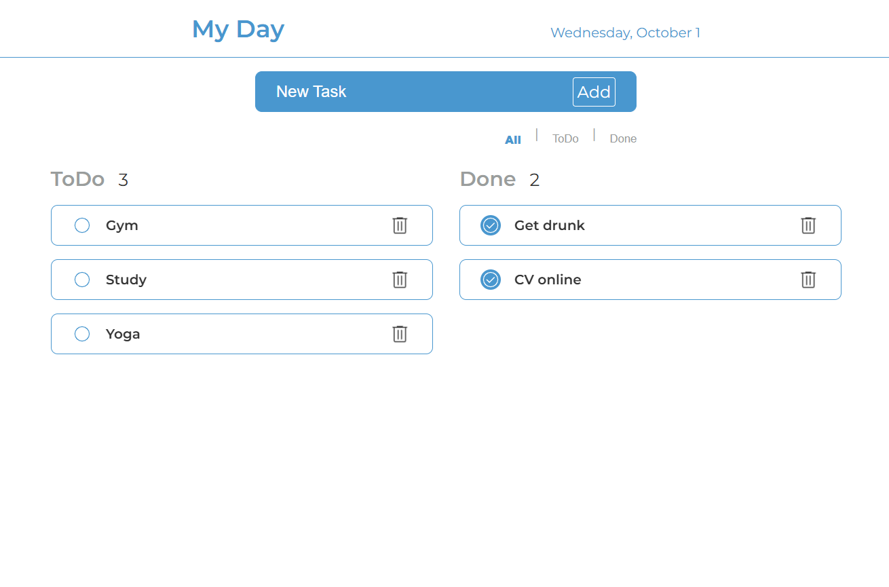

# 📝 ToDo List - My Day

A simple task management app built with **HTML, CSS, and JavaScript**.  
It allows you to create, edit, complete, and delete tasks, as well as filter between pending and completed tasks.  
Data is stored in **LocalStorage**, so your tasks persist even after refreshing the page.

---

## Screenshot

_Add a screenshot of the project here:_



---

## Table of Contents

1. [Features](#-features)
2. [Technologies](#-technologies)
3. [Installation & Usage](#-installation--usage)
4. [What I Learned](#-what-i-learned)
5. [Future Improvements](#-future-improvements)

---

## Features

- ✅ Add new tasks.
- ✏️ Edit existing task names.
- 🔄 Toggle task status (pending ↔ completed).
- 🗑️ Delete tasks.
- 🔍 Filter by **all**, **pending**, or **completed**.
- 💾 Data persistence with **LocalStorage**.
- 🎨 Smooth animations for adding and removing tasks.

---

## Technologies

- **HTML5** for structure.
- **CSS3** with variables and animations.
- **Vanilla JavaScript** for logic and DOM manipulation.
- **LocalStorage** for saving tasks in the browser.

---

## Installation & Usage

1. Clone this repository:

   ```bash
   git clone https://github.com/yourusername/todolist.git

   ```

2. Open the index.html file in your browser.

3. Start organizing your day ✨

## What I Learned

This project helped me practice and deepen my knowledge of:

- DOM manipulation: creating, updating, and removing nodes dynamically.

- Advanced event handling: click, keydown, blur, animationend, and preventing default behaviors.

- LocalStorage persistence: storing and retrieving data across sessions.

- Dynamic IDs and event re-assignment when editing tasks.

- CSS animations integrated with JavaScript logic.

## Future Improvements

- Add drag & drop to reorder tasks.

- Implement quick search for tasks.

- Save data to an API/remote server.

- Add dark/light theme support.
