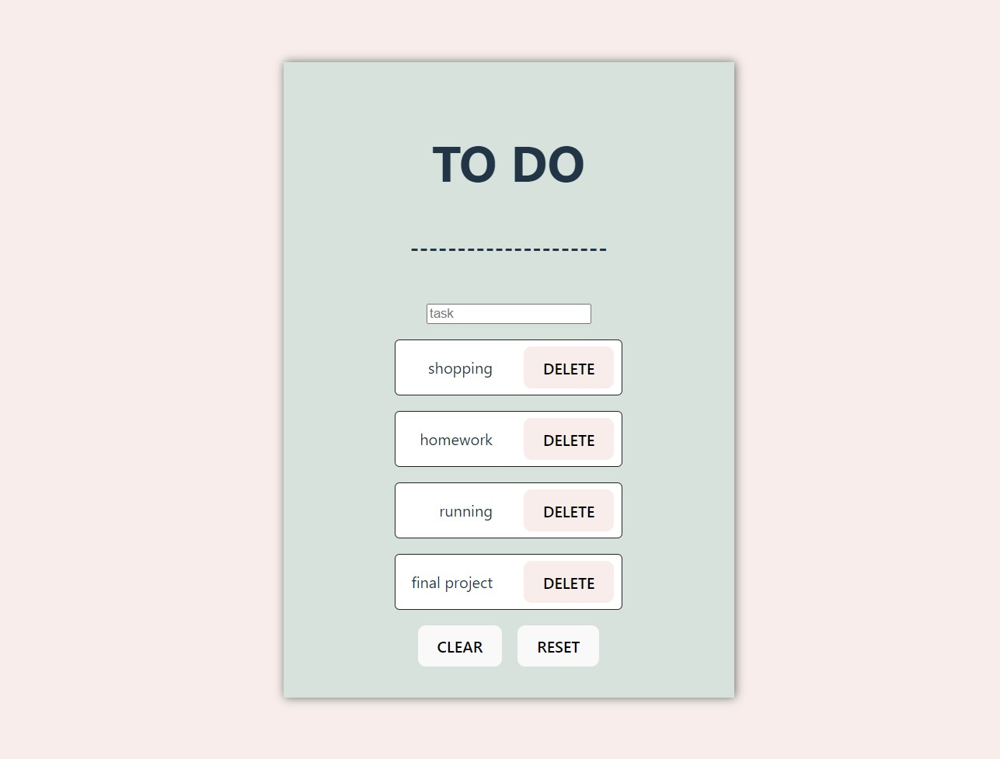

<h1 align="center">To-do list</h1>

  <p align="center">
    Web App where you can add tasks, delete them, reload all and clear all
  </p>
</div>



### Built With

- Vite
- React

## Getting Started

### Prerequisites

You need to install npm. To install the latest version:

- npm
  ```sh
  npm install npm@latest -g
  ```

### Installation

1. Clone the repo
   ```sh
   git clone https://github.com/Radu-A/todo-list.git
   ```
2. Install NPM packages
   ```sh
   npm install
   ```
3. Run the app
   ```js
   npm start
   ```

## Usage

Introduce the name of the task and press "add"
